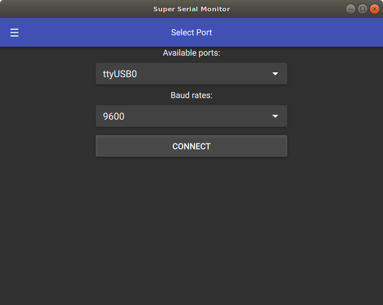
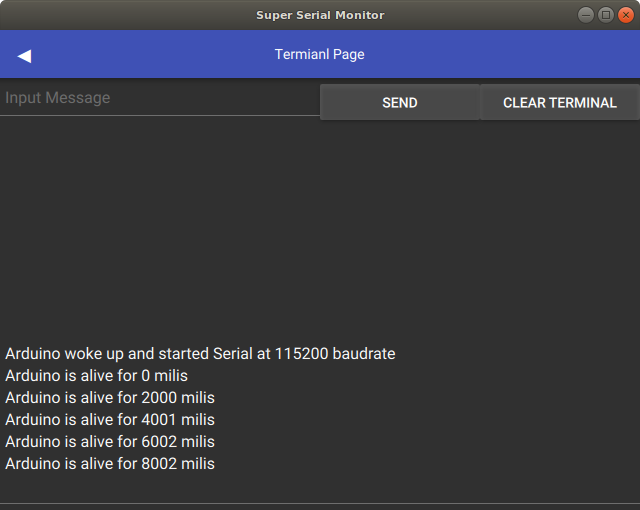

# QtArduinoSerialMonitor
Serial monitor for Arduino and simmilar boards, written in Qt and QML

## Screenshots

First page: **Select Port** page:

* dropdown list of all available ports for serial communication

* dropdown list of supported baud rates

Second page: **Terminal** page

* _input field_ and _send_ button to send a message over serial connection

* _clear_ button to clear the terminal of previous messages

* _text area_ which holds previous messages

